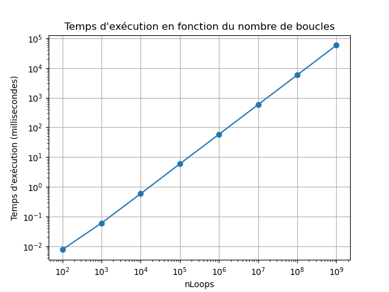

# CSC_5RO05_TA-Gianluca-Baghino-Gomez-2025
Exercices du Cours RO05 / td-1 td-2 td-3 td-4

J’ai configuré le fichier `~/.ssh/config` pour faciliter la connexion avec VSCode, avec des blocs Host comme :
   ```sh
   Host ensta-ssh
     HostName ssh.ensta.fr
     User g.baghino
   
   Host rpi2b-dev
     HostName 147.250.8.198
     User g.baghino
   
   Host rpi2b-dev-remote
     HostName 147.250.8.198
     User g.baghino
     ProxyJump ensta-ssh
   ```

Pour me connecter à la machine de développement rpi2b-dev (`IP : 147.250.8.198`), j’ai utilisé la commande suivante depuis mon terminal :
   ```sh
   ssh g.baghino@147.250.8.198
   ```

Et cela affiche un message de bienvenue, ce qui confirme la connexion réussie au poste distant :
   ```sh
   gianluca@gianluca-ASUS-TUF-Gaming-A15-FA506QM-FA506QM:~$ ssh g.baghino@147.250.8.198
   g.baghino@147.250.8.198's password: 
   Welcome to Ubuntu 24.04.2 LTS (GNU/Linux 6.11.0-19-generic x86_64)
   
    * Documentation:  https://help.ubuntu.com
    * Management:     https://landscape.canonical.com
    * Support:        https://ubuntu.com/pro
   
   1 device has a firmware upgrade available.
   Run `fwupdmgr get-upgrades` for more information.
   
   
   La maintenance de sécurité étendue pour Applications n'est pas activée.
   
   32 mises à jour peuvent être appliquées immédiatement.
   Pour afficher ces mises à jour supplémentaires, exécuter : apt list --upgradable
   
   16 mises à jour de sécurité supplémentaires peuvent être appliquées avec ESM Apps.
   En savoir plus sur l'activation du service ESM Apps at https://ubuntu.com/esm
   
   *** Le système doit être redémarré ***
   
   1 device has a firmware upgrade available.
   Run `fwupdmgr get-upgrades` for more information.
   
   Last login: Wed Apr  2 23:31:21 2025 from 147.250.238.247
   ╭─╾[ensta-ThinkCentre-M800:/home/g.baghino]╼╼╼╼╼╼╼╼╼╼╼╼╼╼╼╼╼╼╼╼╼╼╼╼╼╼╼╼╼╼╼╼╼╼╼╼╼╼╼╼╼╼╼╼╼╼╼╼
   ╰─╾[g.baghino]╼ ls
   MyProject  snap
   ```

Affichage du répertoire de travail avec les fichiers du projet, incluant des fichiers source et d'en-tête pour diverses tâches liées à la synchronisation et au contrôle des threads :

   ```sh
   ─╾[ensta-ThinkCentre-M800:/home/g.baghino/MyProject/src]╼╼╼╼╼╼╼╼╼╼╼╼╼╼╼╼╼╼╼╼╼╼╼╼╼╼╼╼╼╼╼╼╼╼
   ╰─╾[g.baghino]╼ ls
   CalibratorTD3.cpp  LooperTD3.h     ThreadTD3.cpp      td2a.cpp  td3a_1      td3c.cpp
   CalibratorTD3.h    MainChrono.cpp  ThreadTD3.h        td2b      td3a_1.cpp  td3d
   Chrono.cpp         MainPosix.cpp   TimerTD3.cpp       td2b.cpp  td3a_2      td3d.cpp
   Chrono.h           Monitor.cpp     TimerTD3.h         td2c      td3a_2.cpp  td3e
   CounterTD3.cpp     Monitor.h       TimespecUtils.cpp  td2c.cpp  td3a_3      td3e.cpp
   CounterTD3.h       MutexTD3.cpp    TimespecUtils.h    td2d      td3a_3.cpp  td4a
   CpuLoopTD3.cpp     MutexTD3.h      td1a               td2d.cpp  td3b        td4a.cpp
   CpuLoopTD3.h       Semaphore.cpp   td1b               td2e      td3b.cpp    td4b
   LooperTD3.cpp      Semaphore.h     td2a               td2e.cpp  td3c        td4b.cpp
   ╭─╾[ensta-ThinkCentre-M800:/home/g.baghino/MyProject/src]╼╼╼╼╼╼╼╼╼╼╼╼╼╼╼╼╼╼╼╼╼╼╼╼╼╼╼╼╼╼╼╼╼╼
   ╰─╾[g.baghino]╼ 
   ```

# TD1

## td1_a) Gestion simplifiée du temps Posix

Pour le compiler, suivez ces étapes :

1. Naviguez vers le répertoire du projet :
   ```sh
   cd MyProject/src/

2. Compilez les fichiers sources :
   ```sh
   arm-linux-g++ -Wall -Wextra MainPosix.cpp TimespecUtils.cpp -o td1a

3. Transférez le fichier compilé vers le dispositif ARM :
   ```sh
   rsync -avz td1a root@192.168.50.43:

Cela transférera le fichier vers la machine cible avec l'adresse IP 192.168.50.43.

4. Connectez-vous au dispositif ARM via SSH :
   ```sh
   ssh root@192.168.50.43

5. Exécutez le programme compilé :
   ```sh
   ./td1a

Sortie :
   ```sh
   2500.5 ms en secondes : 2500.5 ms
   Temps actuel : 714456 secondes et 592905998 nanosecondes
   Temps négatif : -3 secondes et 499500000 nanosecondes
   Temps additionné : 6 secondes et 500000 nanosecondes
   Temps soustrait : 0 secondes et 999500000 nanosecondes
   Somme des temps : 6 secondes et 500000 nanosecondes
   Différence des temps : 0 secondes et 999500000 nanosecondes
   ```

## td1_b) Classe Chrono

Pour le compiler, suivez ces étapes :

1. Naviguez vers le répertoire du projet :
   ```sh
   cd MyProject/src/

2. Compilez les fichiers sources :
   ```sh
   arm-linux-g++ -Wall -Wextra MainChrono.cpp Chrono.cpp TimespecUtils.cpp -o td1b

3. Transférez le fichier compilé vers le dispositif ARM :
   ```sh
   rsync -avz td1b root@192.168.50.43:

Cela transférera le fichier vers la machine cible avec l'adresse IP 192.168.50.43.

4. Connectez-vous au dispositif ARM via SSH :
   ```sh
   ssh root@192.168.50.43

5. Exécutez le programme compilé :
   ```sh
   ./td1b

Sortie :
   ```sh
   Chrono démarré !
   Temps du tour (secondes): 3s et 504947ns
   Temps écoulé (secondes): 3s et 605416ns
   Temps du tour (ms): 3000.61 ms
   ```

# TD2

## td2_a) Timers avec callback

Pour le compiler, suivez ces étapes :

1. Naviguez vers le répertoire du projet :
   ```sh
   cd MyProject/src/

2. Compilez les fichiers sources :
   ```sh
   arm-linux-g++ -Wall -Wextra td2a.cpp -o td2a

3. Transférez le fichier compilé vers le dispositif ARM :
   ```sh
   rsync -avz td2a root@192.168.50.43:

Cela transférera le fichier vers la machine cible avec l'adresse IP 192.168.50.43.

4. Connectez-vous au dispositif ARM via SSH :
   ```sh
   ssh root@192.168.50.43

5. Exécutez le programme compilé :
   ```sh
   ./td2a

Sortie :
   ```sh
   Timer démarré ! Appuyez sur Ctrl+C pour quitter manuellement si nécessaire.
   Compteur: 1
   Compteur: 2
   Compteur: 3
   Compteur: 4
   Compteur: 5
   Compteur: 6
   Compteur: 7
   Compteur: 8
   Compteur: 9
   Compteur: 10
   Compteur: 11
   Compteur: 12
   Compteur: 13
   Compteur: 14
   Compteur: 15
   Le timer a été arrêté après 15 incrémentations !
   ```

## td2_b) Classe Timer

**Éléments publics (Interface) :**

- `Timer()` (constructeur) et `~Timer()` (destructeur) doivent être publics pour la gestion du cycle de vie des objets.
- `start()`, `start_ms()` et `stop()` sont publics car ils forment l'API principale pour le contrôle du chronomètre.

**Élément protégé (Point d'extension) :**

- `callback()` est protégé car c'est une méthode virtuelle pure qui doit être implémentée par les classes dérivées (polymorphisme), et ne doit pas être appelée directement par les utilisateurs.

**Éléments privés (Détails d'implémentation) :**

- `tid` (`timer_t`) est privé pour encapsuler le gestionnaire de chronomètre POSIX.
- `call_callback()` est privé car c'est une fonction statique utilitaire pour la gestion des signaux POSIX, un mécanisme interne qui ne doit pas être exposé.
  
**Pourquoi cette structure ?**

- Les méthodes publiques fournissent une interface simple (démarrer/arrêter).
- La méthode protégée `callback()` permet la personnalisation dans les classes dérivées.
- Les membres privés cachent la complexité POSIX de bas niveau, assurant sécurité et encapsulation.

Pour le compiler, suivez ces étapes :

1. Naviguez vers le répertoire du projet :
   ```sh
   cd MyProject/src/

2. Compilez les fichiers sources :
   ```sh
   arm-linux-g++ -Wall -Wextra td2b.cpp -o td2b

3. Transférez le fichier compilé vers le dispositif ARM :
   ```sh
   rsync -avz td2b root@192.168.50.43:

Cela transférera le fichier vers la machine cible avec l'adresse IP 192.168.50.43.

4. Connectez-vous au dispositif ARM via SSH :
   ```sh
   ssh root@192.168.50.43

5. Exécutez le programme compilé :
   ```sh
   ./td2b

Sortie :
   ```sh
   Compte à rebours démarré !
   Compte à rebours : 10
   Compte à rebours : 9
   Compte à rebours : 8
   Compte à rebours : 7
   Compte à rebours : 6
   Compte à rebours : 5
   Compte à rebours : 4
   Compte à rebours : 3
   Compte à rebours : 2
   Compte à rebours : 1
   Compte à rebours : 0
   Compte à rebours terminé !
   ```

## td2_c) Fonction simple consommant du CPU

**Const-Correctness**

`getSample()` doit être `const` car :

- Il ne fait que lire les données membres (`m_iLoop`).
- Il ne modifie pas l'état de l'objet.
- Il correspond aux meilleures pratiques C++ pour les méthodes getter.

**Qualification des Variables**

`m_iLoop` (double) :

- Aucune qualification spéciale nécessaire.
- Accédé/modifié uniquement dans `runLoop()`.
- Pas de exigences de sécurité des threads dans ce cas d'utilisation.

`m_doStop` (bool) :

Doit être `volatile` si :

- Utilisé dans un contexte multithread.
- Modifié via des signaux/interruptions.
- Nécessité d'empêcher les optimisations du compilateur.

Pas nécessaire pour un fonctionnement mono-thread.

## Exemple d'Implémentation

```cpp
class Looper {
public:
    double getSample() const { return m_iLoop; } 
    
private:
    double m_iLoop;         
    volatile bool m_doStop; 
};
```

Pour le compiler, suivez ces étapes :

1. Naviguez vers le répertoire du projet :
   ```sh
   cd MyProject/src/

2. Compilez les fichiers sources :
   ```sh
   arm-linux-g++ -Wall -Wextra td2c.cpp Chrono.cpp TimespecUtils.cpp -o td2c

3. Transférez le fichier compilé vers le dispositif ARM :
   ```sh
   rsync -avz td2c root@192.168.50.43:

Cela transférera le fichier vers la machine cible avec l'adresse IP 192.168.50.43.

4. Connectez-vous au dispositif ARM via SSH :
   ```sh
   ssh root@192.168.50.43

5. Exécutez le programme compilé avec différents nombres de boucles :
   ```sh
   ./td2c 100
   ./td2c 1000
   ./td2c 10000
   ./td2c 100000
   ./td2c 1000000
   ./td2c 10000000
   ./td2c 100000000
   ./td2c 1000000000
   ```
   
Sortie :
   ```sh
   nLoops = 100
   Temps d'exécution : 0.007656 millisecondes
   
   nLoops = 1000
   Temps d'exécution : 0.060156 millisecondes
   
   nLoops = 10000
   Temps d'exécution : 0.585469 millisecondes
   
   nLoops = 100000
   Temps d'exécution : 5.915 millisecondes
   
   nLoops = 1000000
   Temps d'exécution : 58.5209 millisecondes
   
   nLoops = 10000000
   Temps d'exécution : 584.381 millisecondes
   
   nLoops = 100000000
   Temps d'exécution : 5843.03 millisecondes
   
   nLoops = 1000000000
   Temps d'exécution : 58428.2 millisecondes
   ```



## td2_d) Échantillonage du temps d’exécution d’une fonction

Pour le compiler, suivez ces étapes :

1. Naviguez vers le répertoire du projet :
   ```sh
   cd MyProject/src/

2. Compilez les fichiers sources :
   ```sh
   arm-linux-g++ -Wall -Wextra td2d.cpp Chrono.cpp TimespecUtils.cpp -o td2d -lrt -pthread -lm

3. Transférez le fichier compilé vers le dispositif ARM :
   ```sh
   rsync -avz td2d root@192.168.50.43:

Cela transférera le fichier vers la machine cible avec l'adresse IP 192.168.50.43.

4. Connectez-vous au dispositif ARM via SSH :
   ```sh
   ssh root@192.168.50.43

5. Exécutez le programme compilé :
   ```sh
   ./td2d

Sortie :
   ```sh
   Résultats de la calibration :
   a = 5.24957e+06, b = 0
   
   Temps demandé : 0.5s
   Boucles prédites : 2.62478e+06
   Durée réelle : 0.499956s
   --------------------------------
   Temps demandé : 0.7s
   Boucles prédites : 3.6747e+06
   Durée réelle : 0.700035s
   --------------------------------
   Temps demandé : 0.9s
   Boucles prédites : 4.72461e+06
   Durée réelle : 0.899683s
   --------------------------------
   Temps demandé : 1.1s
   Boucles prédites : 5.77452e+06
   Durée réelle : 1.09967s
   --------------------------------
   Temps demandé : 1.3s
   Boucles prédites : 6.82444e+06
   Durée réelle : 1.29961s
   --------------------------------
   Temps demandé : 1.5s
   Boucles prédites : 7.87435e+06
   Durée réelle : 1.49943s
   --------------------------------
   Temps demandé : 1.7s
   Boucles prédites : 8.92426e+06
   Durée réelle : 1.6995s
   --------------------------------
   Temps demandé : 1.9s
   Boucles prédites : 9.97418e+06
   Durée réelle : 1.89936s
   --------------------------------
   Temps demandé : 2.1s
   Boucles prédites : 1.10241e+07
   Durée réelle : 2.09928s
   --------------------------------
   Temps demandé : 2.3s
   Boucles prédites : 1.2074e+07
   Durée réelle : 2.29915s
   --------------------------------
   Temps demandé : 2.5s
   Boucles prédites : 1.31239e+07
   Durée réelle : 2.49905s
   --------------------------------
   Temps demandé : 2.7s
   Boucles prédites : 1.41738e+07
   Durée réelle : 2.69912s
   --------------------------------
   Temps demandé : 2.9s
   Boucles prédites : 1.52237e+07
   Durée réelle : 2.89889s
   --------------------------------
   Temps demandé : 3.1s
   Boucles prédites : 1.62737e+07
   Durée réelle : 3.09886s
   --------------------------------
   Temps demandé : 3.3s
   Boucles prédites : 1.73236e+07
   Durée réelle : 3.29881s
   --------------------------------
   Temps demandé : 3.5s
   Boucles prédites : 1.83735e+07
   Durée réelle : 3.4987s
   --------------------------------
   Temps demandé : 3.7s
   Boucles prédites : 1.94234e+07
   Durée réelle : 3.69877s
   --------------------------------
   Temps demandé : 3.9s
   Boucles prédites : 2.04733e+07
   Durée réelle : 3.89891s
   --------------------------------
   Temps demandé : 4.1s
   Boucles prédites : 2.15232e+07
   Durée réelle : 4.09848s
   --------------------------------
   Temps demandé : 4.3s
   Boucles prédites : 2.25731e+07
   Durée réelle : 4.29847s
   --------------------------------
   Temps demandé : 4.5s
   Boucles prédites : 2.3623e+07
   Durée réelle : 4.49829s
   --------------------------------
   Temps demandé : 4.7s
   Boucles prédites : 2.4673e+07
   Durée réelle : 4.69835s
   --------------------------------
   Temps demandé : 4.9s
   Boucles prédites : 2.57229e+07
   Durée réelle : 4.89814s
   --------------------------------
   Temps demandé : 5.1s
   Boucles prédites : 2.67728e+07
   Durée réelle : 5.09803s
   --------------------------------
   Temps demandé : 5.3s
   Boucles prédites : 2.78227e+07
   Durée réelle : 5.29801s
   --------------------------------
   Temps demandé : 5.5s
   Boucles prédites : 2.88726e+07
   Durée réelle : 5.49805s
   --------------------------------
   Temps demandé : 5.7s
   Boucles prédites : 2.99225e+07
   Durée réelle : 5.69789s
   --------------------------------
   Temps demandé : 5.9s
   Boucles prédites : 3.09724e+07
   Durée réelle : 5.8978s
   --------------------------------
   Temps demandé : 6.1s
   Boucles prédites : 3.20224e+07
   Durée réelle : 6.09765s
   --------------------------------
   Temps demandé : 6.3s
   Boucles prédites : 3.30723e+07
   Durée réelle : 6.29778s
   --------------------------------
   Temps demandé : 6.5s
   Boucles prédites : 3.41222e+07
   Durée réelle : 6.49772s
   --------------------------------
   Temps demandé : 6.7s
   Boucles prédites : 3.51721e+07
   Durée réelle : 6.69746s
   --------------------------------
   Temps demandé : 6.9s
   Boucles prédites : 3.6222e+07
   Durée réelle : 6.89743s
   --------------------------------
   Temps demandé : 7.1s
   Boucles prédites : 3.72719e+07
   Durée réelle : 7.09742s
   --------------------------------
   Temps demandé : 7.3s
   Boucles prédites : 3.83218e+07
   Durée réelle : 7.29715s
   --------------------------------
   Temps demandé : 7.5s
   Boucles prédites : 3.93717e+07
   Durée réelle : 7.49721s
   --------------------------------
   Temps demandé : 7.7s
   Boucles prédites : 4.04217e+07
   Durée réelle : 7.69706s
   --------------------------------
   Temps demandé : 7.9s
   Boucles prédites : 4.14716e+07
   Durée réelle : 7.897s
   --------------------------------
   Temps demandé : 8.1s
   Boucles prédites : 4.25215e+07
   Durée réelle : 8.09716s
   --------------------------------
   Temps demandé : 8.3s
   Boucles prédites : 4.35714e+07
   Durée réelle : 8.297s
   --------------------------------
   Temps demandé : 8.5s
   Boucles prédites : 4.46213e+07
   Durée réelle : 8.49681s
   --------------------------------
   Temps demandé : 8.7s
   Boucles prédites : 4.56712e+07
   Durée réelle : 8.69672s
   --------------------------------
   Temps demandé : 8.9s
   Boucles prédites : 4.67211e+07
   Durée réelle : 8.89721s
   --------------------------------
   Temps demandé : 9.1s
   Boucles prédites : 4.77711e+07
   Durée réelle : 9.09677s
   --------------------------------
   Temps demandé : 9.3s
   Boucles prédites : 4.8821e+07
   Durée réelle : 9.29649s
   --------------------------------
   Temps demandé : 9.5s
   Boucles prédites : 4.98709e+07
   Durée réelle : 9.49658s
   --------------------------------
   Temps demandé : 9.7s
   Boucles prédites : 5.09208e+07
   Durée réelle : 9.69642s
   --------------------------------
   Temps demandé : 9.9s
   Boucles prédites : 5.19707e+07
   Durée réelle : 9.89627s
   --------------------------------
   ```

## td2_e) Classe consommatrice de CPU durant un temps donné

Pour le compiler, suivez ces étapes :

1. Naviguez vers le répertoire du projet :
   ```sh
   cd MyProject/src/

2. Compilez les fichiers sources :
   ```sh
   arm-linux-g++ -Wall -Wextra td2e.cpp Chrono.cpp TimespecUtils.cpp -o td2e -lrt -pthread -lm

3. Transférez le fichier compilé vers le dispositif ARM :
   ```sh
   rsync -avz td2e root@192.168.50.43:

Cela transférera le fichier vers la machine cible avec l'adresse IP 192.168.50.43.

4. Connectez-vous au dispositif ARM via SSH :
   ```sh
   ssh root@192.168.50.43

5. Exécutez le programme compilé :
   ```sh
   ./td2e

Sortie :
   ```sh
   Demandé: 0.5s | Réel: 0.501949s | Erreur: 0.389739%
   Demandé: 0.7s | Réel: 0.699873s | Erreur: 0.0181621%
   Demandé: 0.9s | Réel: 0.899594s | Erreur: 0.0451216%
   Demandé: 1.1s | Réel: 1.09954s | Erreur: 0.0417472%
   Demandé: 1.3s | Réel: 1.29941s | Erreur: 0.0453446%
   Demandé: 1.5s | Réel: 1.49924s | Erreur: 0.0505243%
   Demandé: 1.7s | Réel: 1.6993s | Erreur: 0.040959%
   Demandé: 1.9s | Réel: 1.89916s | Erreur: 0.0440488%
   Demandé: 2.1s | Réel: 2.09901s | Erreur: 0.0473364%
   Demandé: 2.3s | Réel: 2.29886s | Erreur: 0.0493909%
   Demandé: 2.5s | Réel: 2.49869s | Erreur: 0.0525625%
   Demandé: 2.7s | Réel: 2.69868s | Erreur: 0.0487809%
   Demandé: 2.9s | Réel: 2.89859s | Erreur: 0.0487392%
   Demandé: 3.1s | Réel: 3.09863s | Erreur: 0.0442222%
   Demandé: 3.3s | Réel: 3.29836s | Erreur: 0.0496007%
   Demandé: 3.5s | Réel: 3.49825s | Erreur: 0.0500283%
   Demandé: 3.7s | Réel: 3.69835s | Erreur: 0.0444975%
   Demandé: 3.9s | Réel: 3.89798s | Erreur: 0.0516907%
   Demandé: 4.1s | Réel: 4.0986s | Erreur: 0.034262%
   Demandé: 4.3s | Réel: 4.29793s | Erreur: 0.0481141%
   Demandé: 4.5s | Réel: 4.49774s | Erreur: 0.0503241%
   Demandé: 4.7s | Réel: 4.69768s | Erreur: 0.0493817%
   Demandé: 4.9s | Réel: 4.89741s | Erreur: 0.0529124%
   Demandé: 5.1s | Réel: 5.09745s | Erreur: 0.0500337%
   Demandé: 5.3s | Réel: 5.29728s | Erreur: 0.0513129%
   Demandé: 5.5s | Réel: 5.49729s | Erreur: 0.0492927%
   Demandé: 5.7s | Réel: 5.69703s | Erreur: 0.0521492%
   Demandé: 5.9s | Réel: 5.89719s | Erreur: 0.0476077%
   Demandé: 6.1s | Réel: 6.09705s | Erreur: 0.0483368%
   Demandé: 6.3s | Réel: 6.29703s | Erreur: 0.0470759%
   Demandé: 6.5s | Réel: 6.49673s | Erreur: 0.0502725%
   Demandé: 6.7s | Réel: 6.69651s | Erreur: 0.0521036%
   Demandé: 6.9s | Réel: 6.8966s | Erreur: 0.0492965%
   Demandé: 7.1s | Réel: 7.0964s | Erreur: 0.0507549%
   Demandé: 7.3s | Réel: 7.29628s | Erreur: 0.0509554%
   Demandé: 7.5s | Réel: 7.49615s | Erreur: 0.051325%
   Demandé: 7.7s | Réel: 7.69618s | Erreur: 0.0495935%
   Demandé: 7.9s | Réel: 7.89618s | Erreur: 0.0483242%
   Demandé: 8.1s | Réel: 8.09598s | Erreur: 0.0496837%
   Demandé: 8.3s | Réel: 8.29577s | Erreur: 0.0509934%
   Demandé: 8.5s | Réel: 8.49567s | Erreur: 0.0509688%
   Demandé: 8.7s | Réel: 8.69551s | Erreur: 0.0516499%
   Demandé: 8.9s | Réel: 8.89552s | Erreur: 0.0503529%
   Demandé: 9.1s | Réel: 9.09536s | Erreur: 0.0509393%
   Demandé: 9.3s | Réel: 9.29525s | Erreur: 0.0511252%
   Demandé: 9.5s | Réel: 9.49552s | Erreur: 0.0471201%
   Demandé: 9.7s | Réel: 9.69506s | Erreur: 0.0509359%
   Demandé: 9.9s | Réel: 9.89483s | Erreur: 0.052237%
   ```

# TD3

## td3_a_1) Création et utilisation de tâches et de mutex Posix

1. Naviguez vers le répertoire du projet :
   ```sh
   cd MyProject/src/

2. Compilez les fichiers sources :
   ```sh
   arm-linux-g++ -Wall -Wextra td3a_1.cpp -o td3a_1 -pthread

3. Transférez le fichier compilé vers le dispositif ARM :
   ```sh
   rsync -avz td3a_1 root@192.168.50.43:

Cela transférera le fichier vers la machine cible avec l'adresse IP 192.168.50.43.

4. Connectez-vous au dispositif ARM via SSH :
   ```sh
   ssh root@192.168.50.43

5. Exécutez le programme compilé :
   ```sh
   ./td3a_1

Sortie :
   ```sh
   Type 's' to stop: s
   Counter value: 1.45107e+08

   Type 's' to stop: s
   Counter value: 1.28209e+08

   Type 's' to stop: s
   Counter value: 1.85957e+08

   Type 's' to stop: s
   Counter value: 1.53486e+08

   Type 's' to stop: s
   Counter value: 1.42248e+08
   ```

L’ordre de grandeur de la valeur du compteur est environ 10^8. Cela signifie qu’en 3 secondes, le compteur peut atteindre entre 120 et 180 millions, selon le moment exact où j’arrête le programme.

## td3_a_2) Création et utilisation de tâches et de mutex Posix

1. Naviguez vers le répertoire du projet :
   ```sh
   cd MyProject/src/

2. Compilez les fichiers sources :
   ```sh
   arm-linux-g++ -Wall -Wextra td3a_2.cpp -o td3a_2 -pthread

3. Transférez le fichier compilé vers le dispositif ARM :
   ```sh
   rsync -avz td3a_2 root@192.168.50.43:

Cela transférera le fichier vers la machine cible avec l'adresse IP 192.168.50.43.

4. Connectez-vous au dispositif ARM via SSH :
   ```sh
   ssh root@192.168.50.43

5. Exécutez le programme compilé :
   ```sh
   ./td3a_2

Sortie :
   ```sh
   Type 's' to stop: s
   Counter value: 1.95446e+07

   Type 's' to stop: s
   Counter value: 1.81169e+07

   Type 's' to stop: s
   Counter value: 1.93251e+07

   Type 's' to stop: s
   Counter value: 1.85321e+07

   Type 's' to stop: s
   Counter value: 1.82106e+07
   ```

L’ordre de grandeur est autour de 10^7. C’est environ 10 fois moins qu’avec une seule tâche. Cela montre que quand plusieurs tâches accèdent à une ressource partagée, elles se ralentissent entre elles à cause des synchronisations nécessaires (accès concurrent au compteur).

Résultat : le compteur augmente moins vite, même avec plusieurs tâches.
Conclusion : Plus de tâches ≠ plus de performance quand il y a une ressource partagée.

## td3_a_3) Création et utilisation de tâches et de mutex Posix

1. Naviguez vers le répertoire du projet :
   ```sh
   cd MyProject/src/

2. Compilez les fichiers sources :
   ```sh
   arm-linux-g++ -Wall -Wextra td3a_3.cpp -o td3a_3 -pthread

3. Transférez le fichier compilé vers le dispositif ARM :
   ```sh
   rsync -avz td3a_3 root@192.168.50.43:

Cela transférera le fichier vers la machine cible avec l'adresse IP 192.168.50.43.

4. Connectez-vous au dispositif ARM via SSH :
   ```sh
   ssh root@192.168.50.43

5. Exécutez le programme compilé :
   ```sh
   ./td3a_3

Sortie :
   ```sh
   Type 's' to stop: s
   Counter value: 5.64658e+06

   Type 's' to stop: s
   Counter value: 5.31826e+06

   Type 's' to stop: s
   Counter value: 5.65542e+06

   Type 's' to stop: s
   Counter value: 5.63302e+06

   Type 's' to stop: s
   Counter value: 5.58301e+06
   ```

On constate une grosse différence! Avec le mutex, la valeur du compteur est beaucoup plus basse (environ 5,6 millions) par rapport à avant (environ 18-19 millions avec 3 tâches sans mutex, et environ 145 millions avec 1 seule tâche sans synchronisation). Cela montre que la synchronisation avec un mutex ralentit fortement l’incrémentation, car les tâches passent leur temps à attendre le verrou.
Conclusion : Protéger les accès avec un mutex assure la sécurité, mais réduit les performances quand plusieurs tâches accèdent à la même ressource.

## td3_b)

1. Naviguez vers le répertoire du projet :
   ```sh
   cd MyProject/src/

2. Compilez les fichiers sources :
   ```sh
   arm-linux-g++ -Wall -Wextra td3b.cpp MutexTD3.cpp TimespecUtils.cpp -o td3b -pthread

3. Transférez le fichier compilé vers le dispositif ARM :
   ```sh
   rsync -avz td3b root@192.168.50.43:

Cela transférera le fichier vers la machine cible avec l'adresse IP 192.168.50.43.

4. Connectez-vous au dispositif ARM via SSH :
   ```sh
   ssh root@192.168.50.43

5. Exécutez le programme compilé :
   ```sh
   ./td3b

Sortie (Premier essai) :
   ```sh
   Thread a verrouillé le mutex, incrémentation du compteur
   Exception de délai d'attente : Timeout après 2000 ms
   Exception de délai d'attente : Timeout après 2000 ms
   Thread a verrouillé le mutex, incrémentation du compteur
   Thread a verrouillé le mutex, incrémentation du compteur
   Thread a verrouillé le mutex, incrémentation du compteur
   Thread a verrouillé le mutex, incrémentation du compteur
   Thread a verrouillé le mutex, incrémentation du compteur
   Thread a verrouillé le mutex, incrémentation du compteur
   Thread a verrouillé le mutex, incrémentation du compteur
   Thread a verrouillé le mutex, incrémentation du compteur
   Thread a verrouillé le mutex, incrémentation du compteur
   Thread a verrouillé le mutex, incrémentation du compteur
   Thread a verrouillé le mutex, incrémentation du compteur
   Thread a verrouillé le mutex, incrémentation du compteur
   Thread a verrouillé le mutex, incrémentation du compteur
   Thread a verrouillé le mutex, incrémentation du compteur
   Thread a verrouillé le mutex, incrémentation du compteur
   Thread a verrouillé le mutex, incrémentation du compteur
   Thread a verrouillé le mutex, incrémentation du compteur
   Thread a verrouillé le mutex, incrémentation du compteur
   Thread a verrouillé le mutex, incrémentation du compteur
   Thread a verrouillé le mutex, incrémentation du compteur
   Thread a verrouillé le mutex, incrémentation du compteur
   Thread a verrouillé le mutex, incrémentation du compteur
   Thread a verrouillé le mutex, incrémentation du compteur
   Thread a verrouillé le mutex, incrémentation du compteur
   Thread a verrouillé le mutex, incrémentation du compteur
   Thread a verrouillé le mutex, incrémentation du compteur
   Thread a verrouillé le mutex, incrémentation du compteur
   Thread a verrouillé le mutex, incrémentation du compteur
   Thread a verrouillé le mutex, incrémentation du compteur
   Thread a verrouillé le mutex, incrémentation du compteur
   Thread a verrouillé le mutex, incrémentation du compteur
   Thread a verrouillé le mutex, incrémentation du compteur
   Thread a verrouillé le mutex, incrémentation du compteur
   Thread a verrouillé le mutex, incrémentation du compteur
   Thread a verrouillé le mutex, incrémentation du compteur
   Thread a verrouillé le mutex, incrémentation du compteur
   Thread a verrouillé le mutex, incrémentation du compteur
   Thread a verrouillé le mutex, incrémentation du compteur
   Thread a verrouillé le mutex, incrémentation du compteur
   Thread a verrouillé le mutex, incrémentation du compteur
   Thread a verrouillé le mutex, incrémentation du compteur
   Thread a verrouillé le mutex, incrémentation du compteur
   Thread a verrouillé le mutex, incrémentation du compteur
   Thread a verrouillé le mutex, incrémentation du compteur
   Thread a verrouillé le mutex, incrémentation du compteur
   Thread a verrouillé le mutex, incrémentation du compteur
   Thread a verrouillé le mutex, incrémentation du compteur
   Thread a verrouillé le mutex, incrémentation du compteur
   Thread a verrouillé le mutex, incrémentation du compteur
   Thread a verrouillé le mutex, incrémentation du compteur
   Thread a verrouillé le mutex, incrémentation du compteur
   Thread a verrouillé le mutex, incrémentation du compteur
   Thread a verrouillé le mutex, incrémentation du compteur
   Thread a verrouillé le mutex, incrémentation du compteur
   Thread a verrouillé le mutex, incrémentation du compteur
   Thread a verrouillé le mutex, incrémentation du compteur
   Thread a verrouillé le mutex, incrémentation du compteur
   Thread a verrouillé le mutex, incrémentation du compteur
   Thread a verrouillé le mutex, incrémentation du compteur
   Thread a verrouillé le mutex, incrémentation du compteur
   Thread a verrouillé le mutex, incrémentation du compteur
   Thread a verrouillé le mutex, incrémentation du compteur
   Thread a verrouillé le mutex, incrémentation du compteur
   Thread a verrouillé le mutex, incrémentation du compteur
   Thread a verrouillé le mutex, incrémentation du compteur
   Thread a verrouillé le mutex, incrémentation du compteur
   Thread a verrouillé le mutex, incrémentation du compteur
   Thread a verrouillé le mutex, incrémentation du compteur
   Thread a verrouillé le mutex, incrémentation du compteur
   Thread a verrouillé le mutex, incrémentation du compteur
   Thread a verrouillé le mutex, incrémentation du compteur
   Thread a verrouillé le mutex, incrémentation du compteur
   Thread a verrouillé le mutex, incrémentation du compteur
   Thread a verrouillé le mutex, incrémentation du compteur
   Thread a verrouillé le mutex, incrémentation du compteur
   Thread a verrouillé le mutex, incrémentation du compteur
   Thread a verrouillé le mutex, incrémentation du compteur
   Thread a verrouillé le mutex, incrémentation du compteur
   Thread a verrouillé le mutex, incrémentation du compteur
   Thread a verrouillé le mutex, incrémentation du compteur
   Thread a verrouillé le mutex, incrémentation du compteur
   Thread a verrouillé le mutex, incrémentation du compteur
   Thread a verrouillé le mutex, incrémentation du compteur
   Thread a verrouillé le mutex, incrémentation du compteur
   Thread a verrouillé le mutex, incrémentation du compteur
   Thread a verrouillé le mutex, incrémentation du compteur
   Thread a verrouillé le mutex, incrémentation du compteur
   Thread a verrouillé le mutex, incrémentation du compteur
   Thread a verrouillé le mutex, incrémentation du compteur
   Thread a verrouillé le mutex, incrémentation du compteur
   Thread a verrouillé le mutex, incrémentation du compteur
   Thread a verrouillé le mutex, incrémentation du compteur
   Thread a verrouillé le mutex, incrémentation du compteur
   Thread a verrouillé le mutex, incrémentation du compteur
   Thread a verrouillé le mutex, incrémentation du compteur
   Thread a verrouillé le mutex, incrémentation du compteur
   Thread a verrouillé le mutex, incrémentation du compteur
   Valeur finale du compteur : 98
   ```

   Sortie (Deuxième essai) :
   ```sh
   Thread a verrouillé le mutex, incrémentation du compteur
   Thread a verrouillé le mutex, incrémentation du compteur
   Thread a verrouillé le mutex, incrémentation du compteur
   Thread a verrouillé le mutex, incrémentation du compteur
   Thread a verrouillé le mutex, incrémentation du compteur
   Thread a verrouillé le mutex, incrémentation du compteur
   Thread a verrouillé le mutex, incrémentation du compteur
   Thread a verrouillé le mutex, incrémentation du compteur
   Thread a verrouillé le mutex, incrémentation du compteur
   Thread a verrouillé le mutex, incrémentation du compteur
   Thread a verrouillé le mutex, incrémentation du compteur
   Thread a verrouillé le mutex, incrémentation du compteur
   Thread a verrouillé le mutex, incrémentation du compteur
   Thread a verrouillé le mutex, incrémentation du compteur
   Thread a verrouillé le mutex, incrémentation du compteur
   Thread a verrouillé le mutex, incrémentation du compteur
   Thread a verrouillé le mutex, incrémentation du compteur
   Thread a verrouillé le mutex, incrémentation du compteur
   Thread a verrouillé le mutex, incrémentation du compteur
   Thread a verrouillé le mutex, incrémentation du compteur
   Thread a verrouillé le mutex, incrémentation du compteur
   Thread a verrouillé le mutex, incrémentation du compteur
   Thread a verrouillé le mutex, incrémentation du compteur
   Thread a verrouillé le mutex, incrémentation du compteur
   Thread a verrouillé le mutex, incrémentation du compteur
   Thread a verrouillé le mutex, incrémentation du compteur
   Thread a verrouillé le mutex, incrémentation du compteur
   Thread a verrouillé le mutex, incrémentation du compteur
   Thread a verrouillé le mutex, incrémentation du compteur
   Thread a verrouillé le mutex, incrémentation du compteur
   Thread a verrouillé le mutex, incrémentation du compteur
   Thread a verrouillé le mutex, incrémentation du compteur
   Thread a verrouillé le mutex, incrémentation du compteur
   Thread a verrouillé le mutex, incrémentation du compteur
   Thread a verrouillé le mutex, incrémentation du compteur
   Thread a verrouillé le mutex, incrémentation du compteur
   Thread a verrouillé le mutex, incrémentation du compteur
   Thread a verrouillé le mutex, incrémentation du compteur
   Thread a verrouillé le mutex, incrémentation du compteur
   Thread a verrouillé le mutex, incrémentation du compteur
   Thread a verrouillé le mutex, incrémentation du compteur
   Thread a verrouillé le mutex, incrémentation du compteur
   Thread a verrouillé le mutex, incrémentation du compteur
   Thread a verrouillé le mutex, incrémentation du compteur
   Thread a verrouillé le mutex, incrémentation du compteur
   Thread a verrouillé le mutex, incrémentation du compteur
   Thread a verrouillé le mutex, incrémentation du compteur
   Thread a verrouillé le mutex, incrémentation du compteur
   Thread a verrouillé le mutex, incrémentation du compteur
   Thread a verrouillé le mutex, incrémentation du compteur
   Thread a verrouillé le mutex, incrémentation du compteur
   Thread a verrouillé le mutex, incrémentation du compteur
   Thread a verrouillé le mutex, incrémentation du compteur
   Thread a verrouillé le mutex, incrémentation du compteur
   Thread a verrouillé le mutex, incrémentation du compteur
   Thread a verrouillé le mutex, incrémentation du compteur
   Thread a verrouillé le mutex, incrémentation du compteur
   Thread a verrouillé le mutex, incrémentation du compteur
   Thread a verrouillé le mutex, incrémentation du compteur
   Thread a verrouillé le mutex, incrémentation du compteur
   Thread a verrouillé le mutex, incrémentation du compteur
   Thread a verrouillé le mutex, incrémentation du compteur
   Thread a verrouillé le mutex, incrémentation du compteur
   Thread a verrouillé le mutex, incrémentation du compteur
   Thread a verrouillé le mutex, incrémentation du compteur
   Thread a verrouillé le mutex, incrémentation du compteur
   Thread a verrouillé le mutex, incrémentation du compteur
   Thread a verrouillé le mutex, incrémentation du compteur
   Thread a verrouillé le mutex, incrémentation du compteur
   Thread a verrouillé le mutex, incrémentation du compteur
   Thread a verrouillé le mutex, incrémentation du compteur
   Thread a verrouillé le mutex, incrémentation du compteur
   Thread a verrouillé le mutex, incrémentation du compteur
   Thread a verrouillé le mutex, incrémentation du compteur
   Thread a verrouillé le mutex, incrémentation du compteur
   Thread a verrouillé le mutex, incrémentation du compteur
   Thread a verrouillé le mutex, incrémentation du compteur
   Thread a verrouillé le mutex, incrémentation du compteur
   Thread a verrouillé le mutex, incrémentation du compteur
   Thread a verrouillé le mutex, incrémentation du compteur
   Thread a verrouillé le mutex, incrémentation du compteur
   Thread a verrouillé le mutex, incrémentation du compteur
   Thread a verrouillé le mutex, incrémentation du compteur
   Thread a verrouillé le mutex, incrémentation du compteur
   Thread a verrouillé le mutex, incrémentation du compteur
   Thread a verrouillé le mutex, incrémentation du compteur
   Thread a verrouillé le mutex, incrémentation du compteur
   Thread a verrouillé le mutex, incrémentation du compteur
   Thread a verrouillé le mutex, incrémentation du compteur
   Thread a verrouillé le mutex, incrémentation du compteur
   Thread a verrouillé le mutex, incrémentation du compteur
   Thread a verrouillé le mutex, incrémentation du compteur
   Thread a verrouillé le mutex, incrémentation du compteur
   Thread a verrouillé le mutex, incrémentation du compteur
   Thread a verrouillé le mutex, incrémentation du compteur
   Thread a verrouillé le mutex, incrémentation du compteur
   Thread a verrouillé le mutex, incrémentation du compteur
   Thread a verrouillé le mutex, incrémentation du compteur
   Thread a verrouillé le mutex, incrémentation du compteur
   Thread a verrouillé le mutex, incrémentation du compteur
   Valeur finale du compteur : 100
   ```

   Sortie (Troisième essai) :
   ```sh
   Thread a verrouillé le mutex, incrémentation du compteur
   Thread a verrouillé le mutex, incrémentation du compteur
   Thread a verrouillé le mutex, incrémentation du compteur
   Thread a verrouillé le mutex, incrémentation du compteur
   Thread a verrouillé le mutex, incrémentation du compteur
   Thread a verrouillé le mutex, incrémentation du compteur
   Thread a verrouillé le mutex, incrémentation du compteur
   Thread a verrouillé le mutex, incrémentation du compteur
   Thread a verrouillé le mutex, incrémentation du compteur
   Thread a verrouillé le mutex, incrémentation du compteur
   Thread a verrouillé le mutex, incrémentation du compteur
   Thread a verrouillé le mutex, incrémentation du compteur
   Thread a verrouillé le mutex, incrémentation du compteur
   Thread a verrouillé le mutex, incrémentation du compteur
   Thread a verrouillé le mutex, incrémentation du compteur
   Thread a verrouillé le mutex, incrémentation du compteur
   Thread a verrouillé le mutex, incrémentation du compteur
   Thread a verrouillé le mutex, incrémentation du compteur
   Thread a verrouillé le mutex, incrémentation du compteur
   Thread a verrouillé le mutex, incrémentation du compteur
   Thread a verrouillé le mutex, incrémentation du compteur
   Thread a verrouillé le mutex, incrémentation du compteur
   Exception de délai d'attente : Timeout après 2000 ms
   Exception de délai d'attente : Timeout après 2000 ms
   Exception de délai d'attente : Timeout après 2000 ms
   Thread a verrouillé le mutex, incrémentation du compteur
   Thread a verrouillé le mutex, incrémentation du compteur
   Thread a verrouillé le mutex, incrémentation du compteur
   Thread a verrouillé le mutex, incrémentation du compteur
   Thread a verrouillé le mutex, incrémentation du compteur
   Thread a verrouillé le mutex, incrémentation du compteur
   Thread a verrouillé le mutex, incrémentation du compteur
   Thread a verrouillé le mutex, incrémentation du compteur
   Thread a verrouillé le mutex, incrémentation du compteur
   Thread a verrouillé le mutex, incrémentation du compteur
   Thread a verrouillé le mutex, incrémentation du compteur
   Thread a verrouillé le mutex, incrémentation du compteur
   Thread a verrouillé le mutex, incrémentation du compteur
   Thread a verrouillé le mutex, incrémentation du compteur
   Thread a verrouillé le mutex, incrémentation du compteur
   Thread a verrouillé le mutex, incrémentation du compteur
   Thread a verrouillé le mutex, incrémentation du compteur
   Thread a verrouillé le mutex, incrémentation du compteur
   Thread a verrouillé le mutex, incrémentation du compteur
   Thread a verrouillé le mutex, incrémentation du compteur
   Exception de délai d'attente : Timeout après 2000 ms
   Thread a verrouillé le mutex, incrémentation du compteur
   Thread a verrouillé le mutex, incrémentation du compteur
   Thread a verrouillé le mutex, incrémentation du compteur
   Thread a verrouillé le mutex, incrémentation du compteur
   Thread a verrouillé le mutex, incrémentation du compteur
   Thread a verrouillé le mutex, incrémentation du compteur
   Thread a verrouillé le mutex, incrémentation du compteur
   Thread a verrouillé le mutex, incrémentation du compteur
   Thread a verrouillé le mutex, incrémentation du compteur
   Thread a verrouillé le mutex, incrémentation du compteur
   Thread a verrouillé le mutex, incrémentation du compteur
   Thread a verrouillé le mutex, incrémentation du compteur
   Thread a verrouillé le mutex, incrémentation du compteur
   Thread a verrouillé le mutex, incrémentation du compteur
   Thread a verrouillé le mutex, incrémentation du compteur
   Thread a verrouillé le mutex, incrémentation du compteur
   Thread a verrouillé le mutex, incrémentation du compteur
   Thread a verrouillé le mutex, incrémentation du compteur
   Thread a verrouillé le mutex, incrémentation du compteur
   Thread a verrouillé le mutex, incrémentation du compteur
   Thread a verrouillé le mutex, incrémentation du compteur
   Thread a verrouillé le mutex, incrémentation du compteur
   Thread a verrouillé le mutex, incrémentation du compteur
   Thread a verrouillé le mutex, incrémentation du compteur
   Thread a verrouillé le mutex, incrémentation du compteur
   Thread a verrouillé le mutex, incrémentation du compteur
   Thread a verrouillé le mutex, incrémentation du compteur
   Thread a verrouillé le mutex, incrémentation du compteur
   Thread a verrouillé le mutex, incrémentation du compteur
   Thread a verrouillé le mutex, incrémentation du compteur
   Thread a verrouillé le mutex, incrémentation du compteur
   Thread a verrouillé le mutex, incrémentation du compteur
   Thread a verrouillé le mutex, incrémentation du compteur
   Thread a verrouillé le mutex, incrémentation du compteur
   Thread a verrouillé le mutex, incrémentation du compteur
   Thread a verrouillé le mutex, incrémentation du compteur
   Thread a verrouillé le mutex, incrémentation du compteur
   Thread a verrouillé le mutex, incrémentation du compteur
   Thread a verrouillé le mutex, incrémentation du compteur
   Thread a verrouillé le mutex, incrémentation du compteur
   Thread a verrouillé le mutex, incrémentation du compteur
   Thread a verrouillé le mutex, incrémentation du compteur
   Thread a verrouillé le mutex, incrémentation du compteur
   Thread a verrouillé le mutex, incrémentation du compteur
   Thread a verrouillé le mutex, incrémentation du compteur
   Thread a verrouillé le mutex, incrémentation du compteur
   Thread a verrouillé le mutex, incrémentation du compteur
   Thread a verrouillé le mutex, incrémentation du compteur
   Thread a verrouillé le mutex, incrémentation du compteur
   Thread a verrouillé le mutex, incrémentation du compteur
   Thread a verrouillé le mutex, incrémentation du compteur
   Thread a verrouillé le mutex, incrémentation du compteur
   Thread a verrouillé le mutex, incrémentation du compteur
   Thread a verrouillé le mutex, incrémentation du compteur
   Valeur finale du compteur : 96
   ```

## td3_c)

1. Naviguez vers le répertoire du projet :
   ```sh
   cd MyProject/src/

2. Compilez les fichiers sources :
   ```sh
   arm-linux-g++ -Wall -Wextra td3c.cpp TimespecUtils.cpp Chrono.cpp MutexTD3.cpp ThreadTD3.cpp CounterTD3.cpp -o td3c -pthread

3. Transférez le fichier compilé vers le dispositif ARM :
   ```sh
   rsync -avz td3c root@192.168.50.43:

Cela transférera le fichier vers la machine cible avec l'adresse IP 192.168.50.43.

4. Connectez-vous au dispositif ARM via SSH :
   ```sh
   ssh root@192.168.50.43

5. Exécutez le programme compilé :
   ```sh
   ./td3c

Sortie :
   ```sh
   Type 's' to stop: s
   Counter value: 3.68555e+06
   Thread 1 execution time: 3046.69 ms
   Thread 2 execution time: 3046.52 ms
   Thread 3 execution time: 3046.25 ms

   Type 's' to stop: s
   Counter value: 3.32343e+06
   Thread 1 execution time: 2840.64 ms
   Thread 2 execution time: 2840.45 ms
   Thread 3 execution time: 2840.27 ms

   Type 's' to stop: s
   Counter value: 3.58756e+06
   Thread 1 execution time: 3138.69 ms
   Thread 2 execution time: 3138.53 ms
   Thread 3 execution time: 3138.29 ms

   Type 's' to stop: s
   Counter value: 3.83885e+06
   Thread 1 execution time: 3204.29 ms
   Thread 2 execution time: 3204.05 ms
   Thread 3 execution time: 3203.83 ms

   Type 's' to stop: s
   Counter value: 3.27935e+06
   Thread 1 execution time: 2736.5 ms
   Thread 2 execution time: 2736.29 ms
   Thread 3 execution time: 2736.12 ms
   ```

## td3_d)

1. Naviguez vers le répertoire du projet :
   ```sh
   cd MyProject/src/

2. Compilez les fichiers sources :
   ```sh
   arm-linux-g++ -Wall -Wextra td3d.cpp Chrono.cpp TimespecUtils.cpp CounterTD3.cpp ThreadTD3.cpp MutexTD3.cpp -o td3d -pthread

3. Transférez le fichier compilé vers le dispositif ARM :
   ```sh
   rsync -avz td3d root@192.168.50.43:

Cela transférera le fichier vers la machine cible avec l'adresse IP 192.168.50.43.

4. Connectez-vous au dispositif ARM via SSH :
   ```sh
   ssh root@192.168.50.43

5. Exécutez le programme compilé :
   ```sh
   ./td3d 1000000 2 0 0
   ```

- 1000000 => Nombre d'incréments (nLoops variant entre 1000 et 100000000).

- 2 => Nombre de threads (nTasks variant de 1 à 5).

- 0 => Désactiver la protection avec pthread_mutex_t (1 pour activer).

- 0 => Politique d'ordonnancement (0 = SCHED_OTHER, 1 = SCHED_RR, 2 = SCHED_FIFO).
   
   ```sh
   ./td3d 1000000 2 1 0
   ./td3d 1000000 2 0 1
   ./td3d 1000000 2 1 1
   ./td3d 1000000 2 0 2
   ./td3d 1000000 2 1 2

   ./td3d 1000000 4 0 0
   ./td3d 1000000 4 1 0
   ./td3d 1000000 4 0 1
   ./td3d 1000000 4 1 1
   ./td3d 1000000 4 0 2
   ./td3d 1000000 4 1 2
   ```

Sortie :
   ```sh
   # ./td3d 1000000 2 0 0
   Counter value: 1.99975e+06 (Expected: 2e+06, Error: 0.01235%)
   Execution time: 0.448934 seconds

   # ./td3d 1000000 2 1 0
   Counter value: 2e+06 (Expected: 2e+06, Error: 0%)
   Execution time: 2.92088 seconds

   # ./td3d 1000000 2 0 1
   Counter value: 1.99991e+06 (Expected: 2e+06, Error: 0.00455%)
   Execution time: 0.449047 seconds

   # ./td3d 1000000 2 1 1
   Counter value: 2e+06 (Expected: 2e+06, Error: 0%)
   Execution time: 2.91599 seconds

   # ./td3d 1000000 2 0 2
   Counter value: 1.99972e+06 (Expected: 2e+06, Error: 0.01395%)
   Execution time: 0.449457 seconds

   # ./td3d 1000000 2 1 2
   Counter value: 2e+06 (Expected: 2e+06, Error: 0%)
   Execution time: 2.87746 seconds

   # ./td3d 1000000 4 0 0
   Counter value: 2.75323e+06 (Expected: 4e+06, Error: 31.1693%)
   Execution time: 0.480016 seconds

   # ./td3d 1000000 4 1 0
   Counter value: 4e+06 (Expected: 4e+06, Error: 0%)
   Execution time: 6.60856 seconds

   # ./td3d 1000000 4 0 1
   Counter value: 2.75615e+06 (Expected: 4e+06, Error: 31.0963%)
   Execution time: 0.479944 seconds

   # ./td3d 1000000 4 1 1
   Counter value: 4e+06 (Expected: 4e+06, Error: 0%)
   Execution time: 6.63295 seconds

   # ./td3d 1000000 4 0 2
   Counter value: 2.75642e+06 (Expected: 4e+06, Error: 31.0894%)
   Execution time: 0.479986 seconds

   # ./td3d 1000000 4 1 2
   Counter value: 4e+06 (Expected: 4e+06, Error: 0%)
   Execution time: 6.60055 seconds
   ```

## td3_e)

1. Naviguez vers le répertoire du projet :
   ```sh
   cd MyProject/src/

2. Compilez les fichiers sources :
   ```sh
   arm-linux-g++ -Wall -Wextra td3e.cpp TimerTD3.cpp LooperTD3.cpp CalibratorTD3.cpp CpuLoopTD3.cpp ThreadTD3.cpp MutexTD3.cpp Chrono.cpp TimespecUtils.cpp CounterTD3.cpp -o td3e -pthread

3. Transférez le fichier compilé vers le dispositif ARM :
   ```sh
   rsync -avz td3e root@192.168.50.43:

Cela transférera le fichier vers la machine cible avec l'adresse IP 192.168.50.43.

4. Connectez-vous au dispositif ARM via SSH :
   ```sh
   ssh root@192.168.50.43

5. Exécutez le programme compilé :
   ```sh
   ./td3e
   ./td3e no-priority

Sortie :
   ```sh
   # ./td3e
   Running with priority inheritance protection (Pass 2)
   Task C started at time: 0.044948 ms
   Task C waiting for the resource
   Task C locked the resource at time: 2000.48 ms
   Task C released the resource at time: 2005.21 ms
   Task A started at time: 3000.35 ms
   Task B started at time: 3000.07 ms
   Task C completed at time: 3005.35 ms
   Task C elapsed time: 3005.41 ms
   Task A waiting for the resource
   Task A locked the resource at time: Task B finished CPU work at time: 4000.54 ms
   4000.17 ms
   Task B completed at time: 4002.48 ms
   Task B elapsed time: 4002.53 ms
   Task A released the resource at time: 4003.1 ms
   Task A completed at time: 6003.28 ms
   Task A elapsed time: 6003.37 ms

   # ./td3e no-priority
   Running with no priority inheritance protection (Pass 1)
   Task C started at time: 0.044428 ms
   Task C waiting for the resource
   Task C locked the resource at time: 2000.43 ms
   Task C released the resource at time: 2004.85 ms
   Task A started at time: 3000.14 ms
   Task B started at time: 3000.06 ms
   Task C completed at time: 3004.94 ms
   Task C elapsed time: 3005 ms
   Task A waiting for the resource
   Task A locked the resource at time: 4000.3 ms
   Task B finished CPU work at time: 4000.17 ms
   Task A released the resource at time: 4002.57 ms
   Task B completed at time: 4002.44 ms
   Task B elapsed time: 4002.48 ms
   Task A completed at time: 6002.66 ms
   Task A elapsed time: 6002.74 ms
   ```

1. Avec protection d'héritage de priorité (./td3e)

   Ordre d'exécution des tâches :
   
      - Tâche C démarre à 0.044948 ms, attend la ressource, et la verrouille à 2000.48 ms. Elle la libère à 2005.21 ms.
      
      - Tâche A et Tâche B commencent à des moments proches, mais Tâche B commence avant Tâche A (à 3000.07 ms contre 3000.35 ms pour la Tâche A). Cela peut être dû au planificateur qui donne la priorité à Tâche B, même si les tâches sont presque simultanées.
      
      - Tâche C se termine à 3005.35 ms, avec un temps écoulé de 3005.41 ms.
        
      - Tâche A attend la ressource, puis la verrouille à 4000.17 ms. Elle libère la ressource à 4003.1 ms et termine à 6003.28 ms.
      
      - Tâche B termine son travail CPU à 4000.54 ms, ce qui est un peu après Tâche A. Cela semble un peu contre-intuitif, mais il est possible que Tâche A ait été mise en attente par le mécanisme de priorité héritée, ce qui a retardé son démarrage.

   Comportement avec héritage de priorité :
   
      - L'héritage de priorité permet à Tâche A de récupérer la priorité après que Tâche B ait terminé son travail CPU. Cela explique pourquoi Tâche A commence son accès à la ressource après Tâche B.

2. Sans protection d'héritage de priorité (./td3e no-priority)

   Ordre d'exécution des tâches :
   
      - Tâche C commence à 0.044428 ms, attend la ressource, la verrouille à 2000.43 ms et la libère à 2004.85 ms.
      
      - Comme dans la première exécution, Tâche A et Tâche B commencent presque en même temps (à 3000.14 ms pour A et 3000.06 ms pour B).
      
      - Tâche C se termine à 3004.94 ms avec un temps écoulé de 3005 ms.
      
      - Tâche A attend la ressource et la verrouille à 4000.3 ms. Elle libère la ressource à 4002.57 ms et se termine à 6002.66 ms.
      
      - Tâche B termine à 4002.44 ms, mais son temps CPU est plus court, car elle est immédiatement préemptée par la ressource partagée.
   
   Comportement sans héritage de priorité :
   
      - Sans héritage de priorité, Tâche B peut prendre plus de temps CPU, et Tâche A attend plus longtemps pour obtenir la ressource, mais elle semble toujours commencer son travail à peu près dans l'ordre attendu. Le manque de priorité héritée signifie que les tâches ne sont pas forcées de suivre un ordre strict de priorité basé sur leurs demandes d'accès à la ressource.

3. Conclusion générale :

   - Avec héritage de priorité, Tâche A obtient la ressource après que Tâche B ait terminé son travail, ce qui peut entraîner une légère attente pour Tâche A.
   
   - Sans héritage de priorité, il y a moins de contrôle sur l'ordre d'exécution des tâches, et le planificateur laisse Tâche B terminer son travail CPU avant que Tâche A ne puisse obtenir la ressource. Cependant, les timings sont un peu plus linéaires.

# TD4

## td4_a)

1. Naviguez vers le répertoire du projet :
   ```sh
   cd MyProject/src/

2. Compilez les fichiers sources :
   ```sh
   arm-linux-g++ -Wall -Wextra td4a.cpp Monitor.cpp MutexTD3.cpp ThreadTD3.cpp Chrono.cpp TimespecUtils.cpp CounterTD3.cpp -o td4a -pthread

3. Transférez le fichier compilé vers le dispositif ARM :
   ```sh
   rsync -avz td4a root@192.168.50.43:

Cela transférera le fichier vers la machine cible avec l'adresse IP 192.168.50.43.

4. Connectez-vous au dispositif ARM via SSH :
   ```sh
   ssh root@192.168.50.43

5. Exécutez le programme compilé :
   ```sh
   ./td4a

Sortie :
   ```sh
   # ./td4a
   Monitor initialisé avec succès !
   Monitor verrouillé...
   Notification envoyée !
   Le thread principal est terminé !
   # 
   ```

## td4_b)

1. Naviguez vers le répertoire du projet :
   ```sh
   cd MyProject/src/

2. Compilez les fichiers sources :
   ```sh
   arm-linux-g++ -Wall -Wextra td4b.cpp Semaphore.cpp MutexTD3.cpp Monitor.cpp ThreadTD3.cpp TimespecUtils.cpp Chrono.cpp CounterTD3.cpp -o td4b -pthread

3. Transférez le fichier compilé vers le dispositif ARM :
   ```sh
   rsync -avz td4b root@192.168.50.43:

Cela transférera le fichier vers la machine cible avec l'adresse IP 192.168.50.43.

4. Connectez-vous au dispositif ARM via SSH :
   ```sh
   ssh root@192.168.50.43

Usage: ./td4b <num_consumers> <num_producers> <tokens_per_producer>

5. Exécutez le programme compilé :
   ```sh
   ./td4b

Sortie :
   ```sh
   # ./td4b 2 3 5
   Producer 1 produced a token.
   Producer 1 produced a token.
   Producer 3 produced a token.
   Producer 3 produced a token.
   Producer 1 produced a token.
   Producer 1 produced a token.
   Producer 1 produced a token.
   Producer 3 produced a token.
   Producer 2 produced a token.
   Consumer 1 consumed a token.
   Consumer 1 consumed a token.
   Consumer 1 consumed a token.
   Consumer 1 consumed a token.
   Consumer 1 consumed a token.
   Consumer 1 consumed a token.
   Consumer 1 consumed a token.
   Consumer 1 consumed a token.
   Producer 2 produced a token.
   Producer 2 produced a token.
   Producer 2 produced a token.
   Producer 2 produced a token.
   Producer 3 produced a token.
   Producer 3 produced a token.
   Consumer 2 consumed a token.
   Consumer 2 consumed a token.
   Consumer 2 consumed a token.
   Consumer 2 consumed a token.
   Consumer 2 consumed a token.
   Consumer 2 consumed a token.
   Consumer 2 consumed a token.
   Consumer 1 consumed 8 tokens.
   Consumer 2 consumed 7 tokens.
   Simulation complete.

   
   # ./td4b 3 4 6
   Producer 1 produced a token.
   Producer 1 produced a token.
   Producer 1 produced a token.
   Producer 1 produced a token.
   Producer 1 produced a token.
   Producer 1 produced a token.
   Producer 3 produced a token.
   Producer 3 produced a token.
   Producer 3 produced a token.
   Producer 4 produced a token.
   Producer 4 produced a token.
   Producer 4 produced a token.
   Producer 4 produced a token.
   Producer 4 produced a token.
   Producer 4 produced a token.
   Consumer 1 consumed a token.
   Consumer 1 consumed a token.
   Consumer 1 consumed a token.
   Consumer 1 consumed a token.
   Consumer 1 consumed a token.
   Consumer 1 consumed a token.
   Consumer 1 consumed a token.
   Consumer 1 consumed a token.
   Consumer 3 consumed a token.
   Consumer 2 consumed a token.
   Producer 2 produced a token.
   Producer 2 produced a token.
   Producer 2 produced a token.
   Producer 2 produced a token.
   Producer 2 produced a token.
   Producer 2 produced a token.
   Consumer 3 consumed a token.
   Consumer 3 consumed a token.
   Consumer 3 consumed a token.
   Consumer 3 consumed a token.
   Consumer 3 consumed a token.
   Consumer 3 consumed a token.
   Consumer 3 consumed a token.
   Producer 3 produced a token.
   Producer 3 produced a token.
   Producer 3 produced a token.
   Consumer 2 consumed a token.
   Consumer 2 consumed a token.
   Consumer 2 consumed a token.
   Consumer 2 consumed a token.
   Consumer 2 consumed a token.
   Consumer 2 consumed a token.
   Consumer 2 consumed a token.
   Consumer 1 consumed 8 tokens.
   Consumer 2 consumed 8 tokens.
   Consumer 3 consumed 8 tokens.
   Simulation complete.

   # ./td4b 4 5 7
   Producer 1 produced a token.
   Producer 1 produced a token.
   Producer 1 produced a token.
   Producer 1 produced a token.
   Producer 1 produced a token.
   Producer 1 produced a token.
   Producer 1 produced a token.
   Producer 3 produced a token.
   Producer 3 produced a token.
   Producer 3 produced a token.
   Producer 3 produced a token.
   Producer 3 produced a token.
   Producer 3 produced a token.
   Producer 3 produced a token.
   Consumer 1 consumed a token.
   Consumer 1 consumed a token.
   Consumer 1 consumed a token.
   Consumer 1 consumed a token.
   Consumer 1 consumed a token.
   Consumer 1 consumed a token.
   Consumer 1 consumed a token.
   Producer 2 produced a token.
   Producer 2 produced a token.
   Producer 2 produced a token.
   Producer 2 produced a token.
   Producer 2 produced a token.
   Producer 2 produced a token.
   Producer 2 produced a token.
   Producer 4 produced a token.
   Producer 4 produced a token.
   Producer 4 produced a token.
   Producer 4 produced a token.
   Producer 4 produced a token.
   Consumer 3 consumed a token.
   Consumer 3 consumed a token.
   Consumer 3 consumed a token.
   Consumer 3 consumed a token.
   Consumer 3 consumed a token.
   Consumer 3 consumed a token.
   Consumer 3 consumed a token.
   Consumer 3 consumed a token.
   Consumer 3 consumed a token.
   Consumer 4 consumed a token.
   Consumer 4 consumed a token.
   Producer 4 produced a token.
   Producer 4 produced a token.
   Producer 5 produced a token.
   Producer 5 produced a token.
   Producer 5 produced a token.
   Producer 5 produced a token.
   Producer 5 produced a token.
   Producer 5 produced a token.
   Producer 5 produced a token.
   Consumer 4 consumed a token.
   Consumer 4 consumed a token.
   Consumer 4 consumed a token.
   Consumer 4 consumed a token.
   Consumer 4 consumed a token.
   Consumer 4 consumed a token.
   Consumer 2 consumed a token.
   Consumer 1 consumed a token.
   Consumer 1 consumed a token.
   Consumer 1 consumed 9 tokens.
   Consumer 2 consumed a token.
   Consumer 2 consumed a token.
   Consumer 2 consumed a token.
   Consumer 2 consumed a token.
   Consumer 2 consumed a token.
   Consumer 2 consumed a token.
   Consumer 2 consumed a token.
   Consumer 2 consumed a token.
   Consumer 2 consumed 9 tokens.
   Consumer 3 consumed 9 tokens.
   Consumer 4 consumed 8 tokens.
   Simulation complete.
   ```
